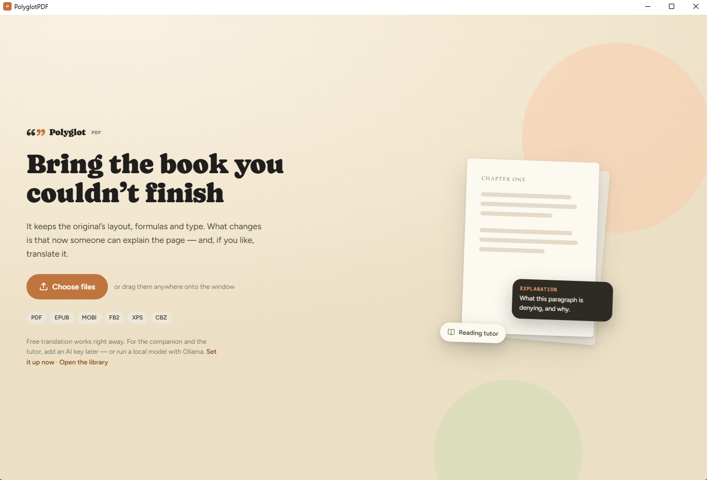
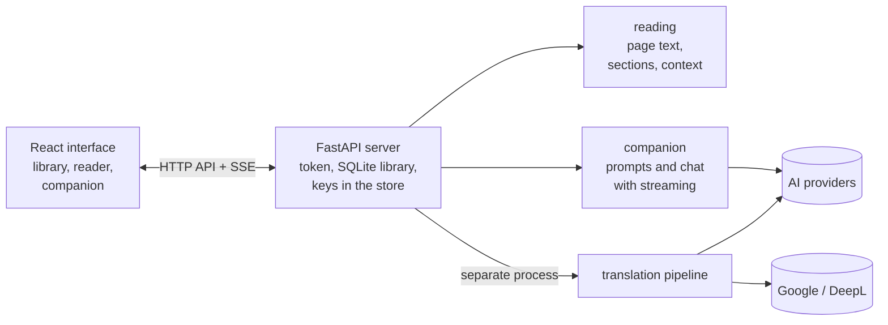

<h1 align="center">PolyglotPDF</h1>

<br>

<p align="center">
  
</p>

<br>

<p align="center">
  <a href="#-about"><strong>About</strong></a> •
  <a href="#-features"><strong>Features</strong></a> •
  <a href="#-installation"><strong>Installation</strong></a> •
  <a href="#%EF%B8%8F-the-app"><strong>App</strong></a> •
  <a href="#%EF%B8%8F-command-line"><strong>Command line</strong></a> •
  <a href="#%EF%B8%8F-architecture"><strong>Architecture</strong></a> •
  <a href="#%EF%B8%8F-development"><strong>Development</strong></a> •
  <a href="#-roadmap"><strong>Roadmap</strong></a>
</p>

<p align="center">
  
  
  
  
  
  
  
</p>

<br>

<p align="center">
  
</p>

<br>

## 📖 About

**PolyglotPDF** is a PDF reader and translator — **scientific papers and e-books** — that keeps the
**original layout** and the **mathematical formulas**, with an **AI reading companion** that
explains any passage you select. Translate for free (Google) or with your own API key (Claude,
GPT, DeepSeek, Gemini, Mistral, Grok, Qwen, DeepL, OpenRouter, Ollama...).

It is a **desktop app** (a native window through pywebview) over a Python core that also works from
the command line and as a library:

```bash
polyglotpdf app                      # opens the desktop app: library, reading, translation and AI
polyglotpdf translate paper.pdf      # command-line translation → paper.pt-BR.pdf
```

> Read the book you could never finish — in the original's layout, with someone to explain the page.

> [!WARNING]
> **Not tested with an API key yet.** The companion, the tutor (session plan, dense passages,
> questions and concept map), the dictionary and AI translation were only checked with the **Echo**
> engine, which calls no AI at all, and translation only with the free Google engine. With a real
> key (Claude, GPT, DeepSeek...) the path is the same, but the quality and the shape of the
> providers' answers have not been verified yet.

<br>

## ✨ Features

| Feature | Description |
|---|---|
| **Desktop app** | A native window (Windows, macOS and Linux) with the library as a shelf or a list, search inside the books and reading progress; reading with selectable text, a table of contents, in-document search and three modes: original, translation and **side by side** (page by page). Imports PDF, EPUB, MOBI, FB2, XPS and CBZ |
| **AI reading companion** | Select a passage and ask for *Explain*, *Context*, *Concepts and formulas*, *Vocabulary*, *Summarise*, *Translate*, *Comment* — or ask anything. The AI receives the title, the authors, the section, the page, the **whole paragraph** (even when it continues in another column or page) and the text **before and after** the passage — ideal for technical questions in papers and for difficult classics (vocabulary, historical context, allusions), with no spoilers. Answers stream in, with rendered formulas, and conversations are kept per document |
| **Reading tutor** | Sessions of 6 to 16 pages built from the table of contents: it says what to expect, marks the dense passages in the margin and closes with questions and a concept map that grows from session to session — every concept with the original's word, the definition and where it shows up in the book — and how much is left at your pace |
| **Layout kept in the translation** | The translated text is recomposed in the original's place with the same type family, weight, italic, size, colour, alignment (justified included, with hyphenation), indents and leading; the font is only shrunk when it has to be |
| **Formulas untouched** | Display equations are not touched; *inline* formulas, subscripts and superscripts are redrawn from the **original vector glyphs** |
| **Whole paragraphs** | Even when split across columns and pages, both in the translation and in the context sent to the AI |
| **Google or AI, your choice** | Google is the default and needs no key. The AI providers' keys live in the system credential store (Windows Credential Manager, macOS Keychain) and serve both the translation and the companion |
| **Study** | Highlights in four colours, notes, bookmarks, a **study notebook** and review cards with spaced repetition |
| **Robust** | Translations run in the background (a separate process), with progress and cancellation; cache, retry, answer validation and a circuit breaker for services that are down. A block that cannot be translated safely stays in the original |
| **Portuguese and English** | The whole interface in both languages, picked in Settings (or the system's); the language of the AI's answers is a separate setting |
| **Ready for other interfaces** | A Python API and an HTTP API documented in [docs/FEATURES.md](docs/FEATURES.md) |

<br>

## ⚙️ Requirements

- **[Python 3.11+](https://www.python.org/)** — preferably with **[uv](https://docs.astral.sh/uv/)**
- **[Node.js 20+](https://nodejs.org/)** — only to build the interface
- **Windows**: the window uses WebView2, which ships with the system
- An **API key** is optional — Google translation is free, and **Ollama** runs a local model with
  no key

<br>

## 🚀 Installation

```bash
uv sync --extra app                  # core + desktop app (a native window through pywebview)
npm --prefix frontend install
npm --prefix frontend run build      # builds the interface into polyglotpdf/app/static
```

Without `uv`: `pip install -e ".[app]"`. Command line only: `uv sync` (no extras, no Node).

**Windows installer.** `uv run python scripts/build_installer.py` freezes the app and wraps it in
`dist/PolyglotPDF-<version>-Setup.exe` — a per-user install that needs no administrator, with a
Start-menu shortcut, an optional desktop one and an uninstaller. It needs
[Inno Setup](https://jrsoftware.org/isdl.php) (`winget install --id JRSoftware.InnoSetup`); see
[Executable and installer](#executable-and-installer).

<br>

## 🖥️ The app

```bash
polyglotpdf app                      # or polyglotpdf-desktop, which opens with no console window
```

It opens the app window with the library. The first time, a single screen asks for files;
afterwards, drag books anywhere onto the window (or use **Import**, which opens the system file
picker) and click a book to open it. Every time a book opens the app asks **how you want to read**
— with the tutor or just read. Exports and "open the data folder" use the system dialogs and file
manager; the window's size and position are remembered. While the library has no books, the
first-run screen says so instead of silently bouncing you back.

- **Reading**: a two-page spread with the PDF in its original layout and a selectable text layer on
  top. A floating pill at the bottom shows the position and calls the companion; the rail on the
  right leads to the chapters. At the top sit the zoom (`Ctrl +`, `Ctrl −`, `Ctrl 0` or `Ctrl` +
  wheel), the mode (*Tutor on* or *Just read*) and, when there is a translation, *Original*,
  *Translation* and *Side by side* (original on the left, translation on the right).
- **Turning the page**: with the arrows or by the corner of the page, like paper — take a corner,
  drag it to the other side and let go past the middle to turn it (before that, it springs back);
  a click on the corner turns it too.
- **Highlighting and noting**: select a passage and pick one of the four colours, or **Note**,
  **Dictionary**, **Explain** and **Ask**. The highlight goes on as ink running along the line and
  is kept in the **study notebook**, anchored to the page it came from.
- **Companion**: the explanation arrives in the margin, beside the page; past three exchanges, the
  conversation rises like a sheet. Drag the handle up (or `Ctrl ↑`) to open it and down to go back
  to the note. The pages the answer cites (*p. 81*) are links. In the library, it searches inside
  the books before answering.
- **Tutor**: it builds sessions of 6 to 16 pages from the table of contents, says what to expect,
  marks the dense passages in the margin and closes with questions and a concept map. The map
  accumulates the sessions: what this one brought, what came back from before and what is coming
  next (which the tutor prepares while you answer), each concept with the original's word, the
  definition, the occurrences and the first page; tapping a term searches for it in the book. At
  the bottom, how much is left of the part of the book you are in, at your reading pace.
- **Review**: the cards come from your highlights and from the dense passages, with four grades
  (*again*, *hard*, *good*, *easy*) and spaced repetition.
- **Settings · Reading**: the app's language (Portuguese, English or the system's), text size,
  conversation width, paper (cream, ivory, sepia or night), page-turn animation, reduce motion,
  advance by pages or by scrolling, the default highlight colour and what happens when you
  highlight.

| Option | Effect |
|--------|--------|
| `--data-dir FOLDER` | where the library and the preferences live |
| `--headless` | development: the internal server only, no window (prints the address) |
| `--port 8765` | port for the internal server (default: a free one) |

- **Data**: `%LOCALAPPDATA%\polyglotpdf\app` on Windows (`~/.local/share/polyglotpdf` elsewhere):
  the SQLite database, imported files, translations and preferences. The API keys live in the
  system credential store, never in those files.
- **Security**: the interface talks to an internal server that listens on `127.0.0.1` only and
  requires an access token (the window receives it when it opens), kept in an
  `HttpOnly`/`SameSite=Strict` cookie; the server also checks the `Host` header and sends a strict
  Content-Security-Policy.

### The reading companion

- It uses the same providers as AI translation (all of them, except DeepL and Google). Add a key in
  **Settings · AI and keys**; the companion automatically uses the first provider with a key, or
  the one you pick. With **Ollama** it runs locally, with no key.
- The passage and its context are sent to the chosen provider. In **Settings · AI and keys** you
  set the context size (short, medium, long), the language of the answers and the reasoning effort;
  in every conversation, the quote at the top of the sheet says what was sent.
- The **Echo** engine (a test one) calls no AI: it answers with the message that would be sent,
  which is useful for checking the detection of title, section and paragraph at no cost.

<br>

## ⌨️ Command line

```bash
# Brazilian Portuguese (the default) with Google Translate (the default)
polyglotpdf translate paper.pdf

# Another language, a few pages only, with a bilingual version
polyglotpdf translate book.pdf -t es -p 1-20 --bilingual

# AI translation: engine, key and, if you like, the model
polyglotpdf translate paper.pdf -e anthropic -k sk-ant-...
polyglotpdf translate paper.pdf -e openai -m gpt-5.6-terra     # key in OPENAI_API_KEY
polyglotpdf translate paper.pdf -e ollama -m qwen3             # a local model, no key

# Available engines, the models the provider offers today and how much there is to translate
polyglotpdf engines
polyglotpdf models -e deepseek
polyglotpdf estimate paper.pdf

# Glossary and a JSON report
polyglotpdf translate paper.pdf -e deepseek -g glossary.toml --report report.json

# See what will be translated (writes paper.inspect.pdf with the boxes coloured by role)
polyglotpdf inspect paper.pdf -v
```

It also works as a library:

```python
from polyglotpdf import Settings, translate_pdf

settings = Settings()
settings.translation.engine = "deepseek"    # default: "google"
settings.translation.api_key = "sk-..."     # or the DEEPSEEK_API_KEY environment variable
report = translate_pdf("paper.pdf", settings=settings)
print(report.output_path, report.translated, report.failed)
```

### Engines

| Engine | Kind | API key | Default model | Companion |
|--------|------|---------|---------------|-----------|
| `google` (default) | free | — | — | — |
| `deepl` | AI (neural translation) | `DEEPL_AUTH_KEY` | — | — |
| `anthropic` (or `claude`) | AI | `ANTHROPIC_API_KEY` | `claude-opus-5` | yes |
| `openai` (or `chatgpt`) | AI | `OPENAI_API_KEY` | `gpt-5.6-terra` | yes |
| `deepseek` | AI | `DEEPSEEK_API_KEY` | `deepseek-v4-flash` | yes |
| `gemini` | AI | `GEMINI_API_KEY` | `gemini-3.8-flash` | yes |
| `mistral` | AI | `MISTRAL_API_KEY` | `mistral-medium-latest` | yes |
| `xai` (or `grok`) | AI | `XAI_API_KEY` | `grok-4.6` | yes |
| `qwen` | AI | `DASHSCOPE_API_KEY` | `qwen-plus` | yes |
| `openrouter` | AI | `OPENROUTER_API_KEY` | `google/gemini-3.7-flash` | yes |
| `ollama` | local AI | — | `qwen3` | yes |
| `openai-compatible` (or `custom`) | AI | the server's | give `-m` and `--base-url` | yes |
| `pseudo`, `echo` | test, offline | — | — | `echo` |

- The key can come from the app (the system credential store), from `-k/--api-key`, from `api_key`
  in the configuration file or from the provider's environment variable. It is only sent to the
  chosen provider.
- **Model names change often**: the defaults above are starting points; the app and
  `polyglotpdf models -e <engine>` list the models the provider offers today.
- **Google**: free, through the same service Chrome uses to translate pages (a batch of paragraphs
  per request, with the style markup preserved); if it refuses, the dictionary endpoint is tried.
  Google limits use per connection: after repeated failures the translation stops and the remaining
  blocks stay in the original. If **nothing** gets translated, the app says so and does not keep a
  "translation" identical to the original.

### Why paragraphs?

Machine translation — neural or by language models — does better with context: pronouns,
agreement, repeated terms and sentences that pick up the previous one all depend on the paragraph.
Isolated sentences lose that information (this is what document-level translation studies show,
such as Läubli et al., 2018; Voita et al., 2019; Wang et al., 2023), and whole documents per
request are too big to validate, to reuse from the cache and to fit back into the layout. So the
unit is the whole paragraph (up to 4 fragments and 9,000 characters). The reading companion uses
the same paragraph joining to build the context of the selected passage.

### `translate` options

| Option | Effect |
|--------|--------|
| `-e/--engine`, `-m/--model`, `-k/--api-key`, `--base-url` | engine, model, key and endpoint |
| `-t/--target`, `-s/--source` | languages (default `pt-BR` / `auto`) |
| `-p/--pages 1-3,7` | translates only those pages (the output holds only them) |
| `--temperature`, `--effort` | model settings (temperature: OpenAI and compatible; effort: Claude) |
| `-g/--glossary` | TOML/JSON glossary (AI engines) |
| `--translate-code` | also translates code listings |
| `--min-scale 0.8` | how much the font may shrink before the leading is tightened |
| `--no-hyphenation`, `--no-cache`, `--concurrency N` | fine tuning |
| `--bilingual`, `--report file.json` | side-by-side output and a report |
| `-c/--config file.toml` | full configuration (see `polyglotpdf.example.toml`) |

A `polyglotpdf.toml` in the current directory is loaded automatically; command-line options take
precedence. Glossary: see `glossary.example.toml`.

<br>

## 🏗️ Architecture



### The translation pipeline

1. **Extraction** (`pdf/extractor.py`): every glyph with its origin, box, font, size and colour.
2. **Analysis** (`analysis/`): body text, blocks, table cells, maths (by font, character and
   baseline shift) and the role of every block.
3. **Flow** (`analysis/flow.py`): joins the fragments of a paragraph across columns and pages.
4. **Segmentation** (`segmentation/`): undoes hyphenation, swaps formulas for placeholders and
   marks bold, italic and monospaced.
5. **Translation** (`translation/`): the engine catalogue, batches, cache, validation, circuit
   breaker.
6. **Typesetting and rendering** (`render/`, `pdf/`): recomposes the text in the original frames and
   removes the old glyphs by their exact origin, redrawing the vector formulas.

The reader reuses the same analysis (`reading/`): the page's text becomes a layer of selectable
words with exact offsets, and a selection is turned into a passage, a paragraph, a section and the
neighbouring text for the companion (`companion/`).

### Folder structure

```
polyglotpdf/
├── api.py, cli.py, pipeline.py, config.py, model.py, errors.py, progress.py
├── pdf/            loader, extractor, content_filter (glyph removal), snippets (formulas)
├── analysis/       fonts, math_detect, document, structure, classifier, flow
├── segmentation/   markup (placeholders/tags), segmenter
├── translation/    engines (the catalogue), registry, service, cache, glossary, languages,
│                   prompts, llm, anthropic_api, openai_api, deepl_api, google, dummy
├── render/         fonts, hyphenation, typesetter, geometry, renderer, bilingual, debug
├── reading/        text (the text layer), index (an open document), context (a passage's context)
├── companion/      chat (streaming per provider), prompts (actions), service (ReadingCompanion),
│                   tutor (the session plan), dictionary (an entry)
└── app/            desktop (the native window and the bridge to the system), launcher and the
                    internal FastAPI server: library, conversations, jobs, worker, secrets,
                    preferences, study (highlights/cards), sessions (tutor), security, routes/;
                    assets/ (the icon) and static/ (the built interface)
frontend/src/       React + TypeScript interface (Vite)
├── i18n/           pt.ts and en.ts (the interface's texts, with the same keys) and t()/tn()
├── styles/         organic.css (design-system tokens) and app.css (the screens)
├── components/     Toasts and the shared pieces (ui.tsx)
└── features/       library, reader, notebook, review, settings, translate, jobs
docs/FEATURES.md    features and APIs (Python and HTTP)
docs/screenshots/   the image used in this README
installer/          polyglotpdf.iss (Inno Setup: the Windows installer)
scripts/            dev_app.py, build_desktop.py (executable), build_installer.py (installer),
                    smoke_desktop.py, make_icon.py
tests/              tests of the core, the reader, the companion and the API (none touch the network)
```

<br>

## 🛠️ Development

```bash
uv run pytest                        # Python tests (none touch the network)
uv run ruff check . && uv run mypy   # lint and types
npm --prefix frontend test           # interface tests (Vitest)
npm --prefix frontend run typecheck  # interface types
```

Interface with hot reload: fix the server's token and run Vite (the proxy passes the token along):

```bash
POLYGLOTPDF_APP_TOKEN=dev uv run polyglotpdf app --headless --port 8765
POLYGLOTPDF_APP_TOKEN=dev npm --prefix frontend run dev
```

In PowerShell, set `$env:POLYGLOTPDF_APP_TOKEN = "dev"` first. Or, with no variable at all:

```bash
uv run python scripts/dev_app.py    # fixed token "dev", library in .devdata/
```

The design-system tokens (paper, the three inks, typography, spacing, radii, control heights,
shadows, motion and the single cover size) live in `frontend/src/styles/organic.css`.

### Executable and installer

```bash
uv run python scripts/build_desktop.py      # builds the interface and writes dist/PolyglotPDF/
uv run python scripts/build_installer.py    # the above + dist/PolyglotPDF-<version>-Setup.exe
uv run python scripts/smoke_desktop.py      # opens the real window and checks the interface
```

`dist/PolyglotPDF/` is the folder to hand out (on Windows, with `PolyglotPDF.exe`);
`--skip-frontend` reuses the interface already built. The installer (`installer/polyglotpdf.iss`,
Inno Setup 6) turns that folder into a single setup executable: it installs per user, with no
administrator, and a new version installs over the previous one; `--skip-build` reuses the folder
already frozen. The icon comes from `scripts/make_icon.py`
(`uv run --no-project --with pillow --with fonttools --with brotli python scripts/make_icon.py`).
On Windows the window uses WebView2, which ships with the system.

<br>

## 🚀 Roadmap

### ✅ Today
- ✅ Translation with the layout, the formulas and paragraphs across columns and pages preserved
- ✅ Free Google and 11 AI providers with your key (or Ollama, locally)
- ✅ Desktop app with a library, a two-page reader, side by side, zoom and page turning by the corner
- ✅ Reading companion with the paragraph's context, and a tutor with sessions, dense passages and questions
- ✅ Highlights, notes, a study notebook and review with spaced repetition
- ✅ Windows executable (PyInstaller) and installer (Inno Setup)

### 💭 Ahead
- 💭 Scanned PDFs (OCR) in the reader and in the translation
- 💭 Right-to-left languages as a target
- 💭 Validated executables and installers for macOS and Linux

<br>

## ⚠️ Known limitations

- **Scanned PDFs** (an image plus an OCR layer) are detected and left as they are; in the reader,
  the text of those pages is not selectable.
- Right-to-left languages are not supported as a translation target.
- Link annotations stay in their original positions.
- The AI engines were tested with simulated clients; a real run depends on your key (and model
  names change — use the provider's model list).
- In a translation, the reading order of the text layer follows the order of the generated PDF; the
  companion's context is more precise when the question is asked on the original.

<br>

## 🤝 Contributing

```bash
git checkout -b feature/YourFeature
# ... your changes ...
git commit -m 'feat: add YourFeature'
git push origin feature/YourFeature
```

English is the project's language: the code, the comments, the docstrings, the documentation and
the command-line messages. The app's interface is bilingual — every text on screen is a key in
`frontend/src/i18n/pt.ts` and `en.ts` (both files must have the same keys), and what the server
writes for people lives in `polyglotpdf/app/i18n.py`.

<br>

## 📄 License

MIT — see [LICENSE](LICENSE).

<br>

## 🙏 Acknowledgements

- 📄 **[PyMuPDF](https://github.com/pymupdf/PyMuPDF)** — reading, analysing and rendering the PDFs
- ⚡ **[FastAPI](https://fastapi.tiangolo.com/)** · **[Uvicorn](https://www.uvicorn.org/)** — the app's internal server
- 🪟 **[pywebview](https://pywebview.flowrl.com/)** — the native window
- ∑ **[KaTeX](https://katex.org/)** · **[marked](https://marked.js.org/)** — formulas and markdown in the answers
- ✂️ **[Pyphen](https://pyphen.org/)** — hyphenation in the target language
- 🔐 **[keyring](https://github.com/jaraco/keyring)** — the keys in the system credential store
- 📦 **[PyInstaller](https://pyinstaller.org/)** · **[Inno Setup](https://jrsoftware.org/isinfo.php)** — the executable and the Windows installer
