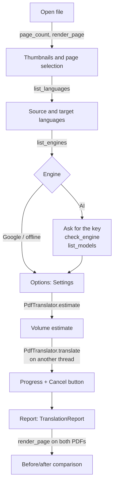

<h1 align="center">PolyglotPDF · Features</h1>

<p align="center"><em>Core reference for interfaces — Python, HTTP and the command line</em></p>

<p align="center">
  <a href="#-1-a-typical-interface-flow"><strong>Flow</strong></a> •
  <a href="#-2-what-the-core-does"><strong>What the core does</strong></a> •
  <a href="#-3-python-api"><strong>Python API</strong></a> •
  <a href="#-4-integration-example"><strong>Integration</strong></a> •
  <a href="#-5-command-line"><strong>Command line</strong></a> •
  <a href="#-6-limits-and-caveats-for-an-interface"><strong>Limits</strong></a> •
  <a href="#-7-reading-and-ai-companion-python-api"><strong>Reading and AI</strong></a> •
  <a href="#-8-desktop-reader-app"><strong>App</strong></a>
</p>

<p align="center">
  <a href="../README.md">← Back to the README</a>
</p>

<br>

This document lists everything the `polyglotpdf` package offers an interface (desktop, web or
command line): what the core does, the public functions with their signatures, the settings, the
progress events, cancellation, the errors and the limits.

Everything here can be called from an interface: nothing is printed, results are plain
*dataclasses* (`to_dict()` returns JSON-ready data) and every error is a subclass of
`PolyglotPDFError`.

```python
from polyglotpdf import (
    PdfTranslator, Settings, translate_pdf,                  # translation
    Estimate, TranslationReport,                             # results
    FunctionProgress, NullProgress, ProgressReporter,        # progress
    EngineInfo, EngineKind, EngineCheck,                     # engines
    list_engines, get_engine, list_models, check_engine,
    list_languages, page_count, render_page,                 # languages and preview
    Cancelled, PolyglotPDFError, __version__,
)
```

<br>

## 🧭 1. A typical interface flow



| Screen / action | Core function |
|-----------------|---------------|
| Open a file, count pages | `page_count(path)` |
| Thumbnails and preview | `render_page(path, page, dpi=...)` |
| Language picker | `list_languages()` |
| Engine picker (standard × AI) | `list_engines(kind)` / `get_engine(name)` |
| Know whether to ask for a key | `EngineInfo.requires_key`, `EngineInfo.has_key`, `EngineInfo.key_env` |
| "Test key" button | `check_engine(engine, api_key, base_url)` |
| Up-to-date model picker | `list_models(engine, api_key, base_url)` |
| Save/restore preferences | `Settings.to_dict()` / `Settings.from_dict()` / `Settings.from_toml()` |
| Estimate the volume (before spending) | `PdfTranslator(settings).estimate(path)` |
| Translate with a progress bar | `PdfTranslator(settings, progress=FunctionProgress(cb)).translate(...)` |
| Cancel | a `threading.Event` passed as `cancel=` |
| See what was detected | `PdfTranslator(settings).inspect(path)` |
| Result | `TranslationReport` (`to_dict()`) |

<br>

## 🔍 2. What the core does

### Input
- PDF; also **EPUB, XPS/OXPS, FB2, MOBI and CBZ**, converted to PDF before translation.
- Rotated pages are normalised. Password-protected PDFs are refused (`InputError`).
- Page selection: `"1-3,7"`, `"-2"` (up to page 2), `"4-"` (from 4 to the end). The output holds
  only the selected pages.
- Scanned pages (image + OCR layer) are detected and kept as they are (a warning goes into the
  report).

### Layout analysis
- Glyph-by-glyph extraction: origin, box, font, size, colour, bold/italic.
- Document statistics: body font and size, detection of TeX documents.
- Merged blocks are split; tables (rows side by side) are broken into **cells**.
- Every block is classified with a role (`BlockRole`, section 3.11).
- Maths detected by font (Computer Modern, AMS, STIX, Cambria Math...), by character (operators,
  Greek letters, mathematical alphanumerics) and by baseline shift (subscripts and superscripts).
- Document title (sent to the AI engines as context).

### The unit of translation: the paragraph
- The translator receives **whole paragraphs**. A paragraph that continues in the next column or
  page is joined before translation when the next fragment starts in lower case, or when the
  previous one does not end with final punctuation and has two lines or more.
- Headers/footers, footnotes, figures, captions, tables and rotated text may sit between the
  fragments; they are skipped. Limit: 4 fragments and 9,000 characters per unit.
- End-of-line hyphenation in the original is undone.
- Table cells are translated one by one, each in its own space.
- **No words are automatically preserved**: titles, names, authors, references, captions,
  footnotes, headers, figure labels, URLs and technical terms all go to the translator.
- Kept in the original: formulas (display or *inline*), code listings (unless
  `content.translate_code = True`), rotated text and scanned pages.
- Formatting preserved through markup: `<b>` (bold), `<i>` (italic), `<c>` (monospaced); inline
  formulas, subscripts and bullets become placeholders `{v1}`, `{v2}`...

### Translation
- Engines: Google (the default, free) or AI with the user's key (section 3.3).
- Batches in reading order (AI models see the neighbouring paragraphs), deduplication of identical
  texts and concurrent requests (the engine's own limit wins: Google and Ollama = 1).
- Placeholders and tags are validated; an invalid answer triggers a "strict" individual retry;
  answers of implausible length are rejected.
- Retry with backoff on temporary errors; a truncated batch is split; a **circuit breaker**: after
  3 failed batches in a row the engine is no longer called and the remaining blocks stay in the
  original.
- SQLite cache: re-runs do not pay twice and long books can be resumed.
- Glossary of required terminology (AI engines backed by language models).
- Safe failure: a block that could not be translated stays in the original and the reason goes
  into the report. Fatal errors (a refused key, a model that does not exist) stop the translation.

### Recomposition
- Same family (serif, sans-serif, monospaced), weight, italic, size, colour, alignment (justified
  included), indents and leading as the original.
- Hyphenation in the target language (pyphen).
- Joined paragraphs flow again through the same frames, in a chain (column 1 → column 2 → next
  page).
- Fitting: first it takes the free space around the block; then it shrinks the font by binary
  search down to `layout.min_font_scale`; then it tightens the leading; the absolute limit is
  `layout.hard_min_font_scale` (below it the text overflows and is counted in the report). The
  scale is harmonised per page for blocks of the same kind and size.
- The original is removed glyph by glyph (no white rectangles); inline formulas are redrawn from
  the original vector glyphs; the output text is selectable.
- Built-in fonts (Times, Helvetica, Courier; CJK for Chinese, Japanese and Korean) or `.ttf/.otf`
  files; a fallback font for missing glyphs; subsets embedded.

### Output
- `<name>.<language>.pdf` (or the path given); the input is never overwritten.
- Optional: a side-by-side bilingual PDF, `<output>.dual.pdf`.
- Optional: an inspection PDF with the boxes coloured by role.
- A report (`TranslationReport`) with counts, warnings and failure reasons.

<br>

## 🐍 3. Python API

### 3.1 Document and preview

```python
page_count(path: str | Path) -> int
render_page(path: str | Path, page: int = 0, *, dpi: int = 110) -> bytes   # PNG
```

- `page` starts at 0. A page that does not exist or an unreadable file → `InputError`.
- Use `render_page` on the original and on the translation for the before/after comparison.

### 3.2 Languages

```python
list_languages() -> list[tuple[str, str]]   # [("pt-BR", "Brazilian Portuguese"), ...]
```

- `(code, English name)` pairs sorted by name.
- The source also accepts `"auto"` (automatic detection). Codes with a region (`pt-BR`, `en-US`)
  are accepted; each engine receives the code in the format it understands.
- Right-to-left languages (Arabic, Hebrew, Persian, Urdu) are not supported as a target.

### 3.3 Translation engines

```python
list_engines(kind: EngineKind | None = None) -> list[EngineInfo]
get_engine(name: str) -> EngineInfo          # accepts aliases; unknown name → ConfigError
list_models(engine: str, api_key: str | None = None, base_url: str | None = None,
            *, timeout: float = 20.0) -> list[str]
check_engine(engine: str, api_key: str | None = None,
             base_url: str | None = None) -> EngineCheck
```

`EngineKind`: `STANDARD` (`"standard"`, free, the default), `AI` (`"ai"`, with the user's key),
`OFFLINE` (`"offline"`, test engines).

`EngineInfo` (immutable):

| Field | Type | Meaning |
|-------|------|---------|
| `name` | `str` | identifier (`settings.translation.engine`) |
| `label` | `str` | name to display |
| `kind` | `EngineKind` | standard, AI or offline |
| `description` | `str` | short description (in English; the app translates it, section 8.1) |
| `key_env` | `tuple[str, ...]` | environment variables read for the key, in order |
| `requires_key` | `bool` | whether the interface must ask for a key |
| `default_model` | `str \| None` | model used when `model` is `None` |
| `base_url` | `str \| None` | default endpoint |
| `lists_models` | `bool` | whether `list_models` works for this engine |
| `supports_glossary` | `bool` | whether the glossary is applied |
| `website` | `str` | where the user gets the key |
| `api_key(explicit=None)` | method | the explicit key, or the first environment variable set |
| `has_key` | property | there is a key in the environment |

The current catalogue:

| `name` (aliases) | Kind | Key variables | Default model | Glossary | Notes |
|------------------|------|---------------|---------------|----------|-------|
| `google` | standard | — | — | no | free: `translateHtml` (Chrome's page translator, one batch per request), with the dictionary endpoint as a fallback; one request at a time; limits use per connection |
| `deepl` | ai | `DEEPL_AUTH_KEY`, `DEEPL_API_KEY` | — | no | native XML tags; `base_url` = DeepL server; an exhausted quota is a fatal error |
| `anthropic` (`claude`) | ai | `ANTHROPIC_API_KEY`, `ANTHROPIC_AUTH_TOKEN` | `claude-opus-5` | yes | structured output, prompt caching, `effort`, server-side fallback on refusals; also accepts an `ant auth login` profile |
| `openai` (`chatgpt`) | ai | `OPENAI_API_KEY` | `gpt-5.6-terra` | yes | Responses API with a strict JSON Schema |
| `deepseek` | ai | `DEEPSEEK_API_KEY` | `deepseek-v4-flash` | yes | OpenAI-compatible (JSON mode) |
| `gemini` | ai | `GEMINI_API_KEY`, `GOOGLE_API_KEY` | `gemini-3.8-flash` | yes | OpenAI-compatible endpoint (JSON Schema) |
| `mistral` | ai | `MISTRAL_API_KEY` | `mistral-medium-latest` | yes | OpenAI-compatible (JSON mode) |
| `xai` (`grok`) | ai | `XAI_API_KEY` | `grok-4.6` | yes | OpenAI-compatible (JSON Schema) |
| `qwen` | ai | `DASHSCOPE_API_KEY` | `qwen-plus` | yes | international endpoint; inside China, change `base_url` |
| `openrouter` | ai | `OPENROUTER_API_KEY` | `google/gemini-3.7-flash` | yes | models from many providers with one key |
| `ollama` | ai | — | `qwen3` | yes | local (`http://localhost:11434/v1`), no key, one request at a time |
| `openai-compatible` (`custom`) | ai | — (use `api_key`) | — | yes | any Chat Completions server: needs `model` and `base_url` |
| `pseudo` | offline | — | — | no | accents and stretches ~30%: tests the layout |
| `echo` | offline | — | — | no | returns the original: tests extraction and recomposition |

**API key.** Lookup order: `settings.translation.api_key` → the `key_env` variables. Without a
key, an engine with `requires_key` raises `ConfigError` **before** the document is analysed. The
key is only sent to the chosen provider; `Settings.to_dict()` masks it and it appears neither in
the report nor in the logs. In an interface, keep it in the system credential store (with the
`keyring` library, for instance) and not in the preferences JSON.

**Models.** Names change every few months; the catalogue's defaults are only starting points.
Fill the picker with `list_models(...)`, which asks the provider and returns the sorted IDs; if it
fails, offer `default_model` and a free-text field. Errors: `FatalTranslationError` (key refused),
`TranslationError` (network, service), `ConfigError` (`base_url` missing). Engines without
`lists_models` return `[]`.

**Testing the key.** `check_engine` makes a single cheap request (it lists the models; on DeepL it
queries the quota) and **never translates nor raises**: it returns
`EngineCheck(ok: bool, message: str, models: list[str])`. Google and the offline engines always
answer `ok=True`.

### 3.4 Settings (`Settings`)

`Settings` has five sections and the `pages` field. Every field has a default; `Settings()` is
valid.

**`settings.translation`**

| Field | Type | Default | Description |
|-------|------|---------|-------------|
| `engine` | `str` | `"google"` | engine name or alias |
| `source_lang` | `str` | `"auto"` | source language or `"auto"` |
| `target_lang` | `str` | `"pt-BR"` | target language |
| `model` | `str \| None` | `None` | `None` = the engine's `default_model` |
| `api_key` | `str \| None` | `None` | `None` = the engine's environment variable |
| `base_url` | `str \| None` | `None` | `None` = the default endpoint (required for `openai-compatible`) |
| `temperature` | `float \| None` | `None` | 0–2; OpenAI and compatible engines; `None` = the provider's default |
| `effort` | `str` | `"medium"` | Claude only: `low`, `medium`, `high`, `xhigh`, `max` |
| `concurrency` | `int` | `4` | simultaneous requests (the engine's limit wins) |
| `batch_max_items` | `int` | `40` | segments per request |
| `batch_max_chars` | `int` | `7000` | characters per request (minimum 200) |
| `request_timeout` | `float` | `600.0` | per-request timeout, in seconds |
| `max_retries` | `int` | `4` | retries on temporary errors |
| `use_cache` | `bool` | `True` | use the SQLite translation cache |
| `cache_path` | `Path \| None` | `None` | `None` = `default_cache_path()` |
| `glossary_path` | `Path \| None` | `None` | `.toml` or `.json` glossary |

**`settings.content`**: `translate_code: bool = False` (monospaced code listings).

**`settings.layout`**

| Field | Default | Description |
|-------|---------|-------------|
| `min_font_scale` | `0.72` | preferred lower bound when shrinking the font |
| `hard_min_font_scale` | `0.5` | absolute lower bound (below it the text overflows) |
| `expand_into_free_space` | `True` | take the free space around the block |
| `hyphenate` | `True` | hyphenation in the target language |

Rule: `0.2 ≤ hard_min_font_scale ≤ min_font_scale ≤ 1.0`.

**`settings.fonts`**: `serif`, `serif_bold`, `serif_italic`, `serif_bold_italic`, `sans`,
`sans_bold`, `sans_italic`, `sans_bold_italic`, `mono`, `mono_bold`, `fallback` — all
`str | None`: a built-in font name (`tiro`, `tibo`, `tiit`, `tibi`, `helv`, `hebo`, `heit`,
`hebi`, `cour`, `cobo`, `coit`, `cobi`, `cjk`) or the path to a `.ttf/.otf`. `None` = the built-in
fonts.

**`settings.output`**: `bilingual: bool = False`, `subset_fonts: bool = True`,
`keep_all_pages: bool = False` (with `pages`, keep the other pages in the original instead of
dropping them, so the translation lines up page by page with the original).

**`settings.pages`**: `str | None = None` (e.g. `"1-3,7"`; `None` = the whole document).

Methods and functions:

```python
Settings.validate() -> Settings                     # ConfigError if anything is invalid
Settings.to_dict(*, include_secrets: bool = False) -> dict   # the key becomes "********"
Settings.from_dict(data: Mapping) -> Settings       # "********" becomes None again
Settings.from_toml(path) -> Settings                # paths relative to the file
polyglotpdf.config.with_overrides(settings, translation={...}, layout={...}, root={"pages": ...})
polyglotpdf.config.default_cache_path() -> Path     # %LOCALAPPDATA% or ~/.cache
```

Unknown keys in `from_dict`/`from_toml` raise `ConfigError`. `with_overrides` ignores `None`
values (handy for merging the interface's form with the saved configuration).

### 3.5 Estimate

```python
PdfTranslator(settings).estimate(path) -> Estimate
```

Analyses the document **without translating, without network and without a key**. `Estimate`
fields:

| Field | Meaning |
|-------|---------|
| `pages` | selected pages |
| `blocks` | detected blocks |
| `segments` | units to translate |
| `merged_paragraphs` | paragraphs joined across columns/pages |
| `characters` | characters sent to the translator (without markup or formulas) |
| `words` | words sent |
| `formulas` | inline formulas and subscripts kept as vector cut-outs |
| `roles` | block count per role |

The core embeds no prices (they change per provider and over time). To estimate cost, an interface
can apply its own table to `characters`. As a rough reference: English text runs about 4
characters per token, the output is about the size of the input, and every batch also sends the
instructions (Claude reuses them through prompt caching).

### 3.6 Translation

```python
PdfTranslator(settings: Settings | None = None, *,
              translator: Translator | None = None,
              progress: ProgressReporter | None = None)

PdfTranslator.translate(input_path, output_path=None, *,
                        cancel: threading.Event | None = None) -> TranslationReport

translate_pdf(input_path, output_path=None, settings=None, *,
              translator=None, progress=None, cancel=None) -> TranslationReport
```

- The constructor validates the settings (`ConfigError`).
- `translate` blocks until it is done: run it on a worker thread (or process).
- Order: the engine is created (a missing key/model shows up here, before any work) → analyse →
  translate → recompose → write. `output_path=None` writes `<name>.<language>.pdf` next to the
  input.
- One `PdfTranslator` per job. Translating different files at the same time works, but they share
  the cache; prefer one at a time, or separate `cache_path`s.

### 3.7 Progress

Stages, in order: `analyze` → `translate` → `render`.

| Stage | Unit of the total |
|-------|-------------------|
| `analyze` | selected pages |
| `translate` | unique texts (identical segments count once); cache hits and failures advance it too |
| `render` | pages |

`estimate()` and `inspect()` emit `analyze` only.

```python
class ProgressReporter(Protocol):
    def start(self, stage: str, total: int) -> None: ...
    def advance(self, stage: str, amount: int = 1) -> None: ...
    def finish(self, stage: str) -> None: ...

FunctionProgress(callback: Callable[[str, int, int], None])   # callback(stage, done, total)
NullProgress()
```

`FunctionProgress` is the simplest form: it calls `callback(stage, done, total)` on every change.
**The callback may run on worker threads** (translation is concurrent): in Qt, Tk, GTK and the
like, hand the event over to the interface thread (a signal, `after`, `idle_add`, a queue).

### 3.8 Cancellation

Pass a `threading.Event` as `cancel=` and call `event.set()` (from the Cancel button, say). The
core checks the event between pages during analysis, before every translation batch, while waiting
to retry (it wakes up at once) and between pages during recomposition; then it raises `Cancelled`.
No file is written, but the translations already received stay in the cache: starting again pays
only for the rest.

### 3.9 The report (`TranslationReport`)

| Field | Meaning |
|-------|---------|
| `input_path`, `output_path`, `bilingual_path` | files |
| `engine` | engine/model/prompt version (e.g. `anthropic/claude-opus-5/prompt-4`) |
| `target_lang` | target language |
| `pages`, `blocks`, `roles` | pages, blocks and the count per role |
| `segments` | translation units |
| `merged_paragraphs` | paragraphs joined across columns/pages |
| `translated`, `failed` | segments translated and segments kept in the original |
| `cache_hits`, `requests` | reused from the cache and requests made |
| `shrunk`, `min_scale` | blocks with a smaller font and the smallest scale used |
| `overflowed` | blocks that did not fit even at the absolute limit |
| `scanned_pages` | scanned pages (numbered from 1) |
| `missing_glyphs` | characters with no font available |
| `warnings` | warnings (scanned pages, glossary ignored, missing glyphs) |
| `failures` | up to 50 items, `"<id>: <reason>; original kept"` |
| `elapsed_seconds` | duration |

`report.to_dict()` returns everything as JSON; the API key never shows up.

### 3.10 Inspection and analysis

```python
PdfTranslator(settings).inspect(input_path, output_path=None) -> tuple[DocumentLayout, Path]
PdfTranslator(settings).analyze(document: pymupdf.Document, pages, cancel=None) -> DocumentLayout
PdfTranslator(settings).segments(layout) -> tuple[list[Segment], list[int]]
```

`inspect` writes `<name>.inspect.pdf` with the boxes coloured by role and returns the layout:
`layout.title`, `layout.stats` (`body_font`, `body_size`, `tex_body`), `layout.pages` and
`layout.blocks()` (every `Block` has `uid`, `page`, `bbox`, `role`, `reason` and `text`). It is
useful for a diagnostics screen ("why was this block not translated?").

### 3.11 Block roles (`polyglotpdf.model.BlockRole`)

| Role | Treatment |
|------|-----------|
| `paragraph`, `heading`, `title`, `caption`, `list_item`, `footnote`, `header_footer`, `reference`, `author`, `figure_text`, `table` | translated |
| `code` | translated only with `content.translate_code = True` |
| `display_math`, `non_text`, `rotated`, `unknown` | kept |

### 3.12 Glossary

A TOML or JSON file with a single key, `terms` (source term → required translation):

```toml
[terms]
"residual learning" = "aprendizado residual"
```

Applied by the engines with `supports_glossary` (the AI ones backed by language models). With
Google or DeepL the report carries a warning. The old `keep` key is rejected (`ConfigError`).

### 3.13 Errors

| Exception | When | Suggestion for the interface |
|-----------|------|------------------------------|
| `PolyglotPDFError` | the base of them all | a generic catch |
| `InputError` | unreadable or unsupported file, password-protected PDF, page that does not exist, output equal to the input, write failure | ask for another file/path |
| `ConfigError` | invalid configuration, unknown engine, missing key, missing `model`/`base_url`, invalid glossary or page range | highlight the field |
| `Cancelled` | the `cancel` event was set | go back to the initial state |
| `FatalTranslationError` | key refused, model that does not exist, quota exhausted, request rejected | ask for another key/model |
| `TranslationError` | engine failure (e.g. `list_models` with no network) | try again |

`TransientTranslationError`, `BatchTooLargeError` and `RefusalError` are handled internally
(retry, batch splitting, fallback) and normally do not reach the interface. Failures that do not
stop the translation show up in `report.failed` and `report.failures`.

### 3.14 Your own engine

```python
from collections.abc import Sequence
from polyglotpdf.translation.base import TranslationContext, TranslationRequest, Translator

class MyEngine(Translator):
    name = "my-engine"
    max_batch_items = 20
    supports_glossary = False
    max_concurrency = 2            # None = limited only by the settings

    def fingerprint(self) -> str:  # goes into the cache key
        return "my-engine/v1"

    def translate_batch(
        self, requests: Sequence[TranslationRequest], context: TranslationContext
    ) -> list[str | None]:
        # Keep {v1}, {v2}... and the <b>, <i>, <c> tags. Return one item per request
        # (None if that item failed). It must be safe to call from several threads.
        ...

PdfTranslator(settings, translator=MyEngine()).translate("paper.pdf")
```

An engine passed as `translator=` replaces `settings.translation.engine` and is not closed by the
pipeline (call `close()` yourself).

### 3.15 Cache

SQLite at `default_cache_path()` (`%LOCALAPPDATA%\polyglotpdf\translations.sqlite3` on Windows,
`~/.cache/polyglotpdf/` elsewhere) or at `translation.cache_path`. The key combines the text, the
languages, the engine/model/prompt version and the glossary: changing any of them produces new
translations. Turn it off with `use_cache = False` (or `--no-cache`).

<br>

## 🧩 4. Integration example

```python
import queue
import threading

from polyglotpdf import (
    Cancelled, FunctionProgress, PdfTranslator, PolyglotPDFError, Settings,
    check_engine, get_engine,
)

events: queue.Queue = queue.Queue()      # consumed by the interface thread
cancel = threading.Event()               # the "Cancel" button: cancel.set()

settings = Settings()
settings.translation.engine = "deepseek"
settings.translation.api_key = user_key  # from the system credential store

info = get_engine(settings.translation.engine)
if info.requires_key:
    check = check_engine(info.name, settings.translation.api_key)
    if not check.ok:
        raise SystemExit(check.message)  # show it in the interface

def job(path: str) -> None:
    progress = FunctionProgress(lambda stage, done, total: events.put(("progress", stage, done, total)))
    try:
        report = PdfTranslator(settings, progress=progress).translate(path, cancel=cancel)
        events.put(("done", report.to_dict()))
    except Cancelled:
        events.put(("cancelled",))
    except PolyglotPDFError as exc:
        events.put(("error", type(exc).__name__, str(exc)))

threading.Thread(target=job, args=("paper.pdf",), daemon=True).start()
```

<br>

## 💻 5. Command line

| Command | What it does |
|---------|--------------|
| `polyglotpdf translate FILE [options]` | translates |
| `polyglotpdf estimate FILE [-p] [-c]` | counts segments, words, characters and formulas |
| `polyglotpdf inspect FILE [-o] [-p] [-v]` | writes the annotated PDF and the table of roles |
| `polyglotpdf engines` | lists the engines, the kind, the state of the key and the default model |
| `polyglotpdf models -e ENGINE [-k] [--base-url]` | lists the models the provider offers today |

`translate` options: `-o/--output`, `-t/--target`, `-s/--source`, `-e/--engine`, `-m/--model`,
`-k/--api-key`, `--base-url`, `--temperature`, `--effort`, `-g/--glossary`, `--concurrency`,
`--bilingual`, `--translate-code`, `--min-scale`, `--no-hyphenation`, `--no-cache`,
`--report FILE.json`, `-p/--pages`, `-c/--config`, `-v/-vv`, `-q`.

Exit codes: `0` success, `1` known error, `2` unexpected error, `130` cancelled.

<br>

## 🚧 6. Limits and caveats for an interface

- `translate` blocks; run it off the interface thread. The progress callback arrives from worker
  threads.
- **PyMuPDF is not thread-safe.** In an application that also renders pages, run translations in
  another process (as the app does, section 8) or serialise every call with
  `polyglotpdf.reading.MUPDF_LOCK`.
- Google is free, but it limits use per connection; after repeated failures the circuit breaker
  stops the translation and the remaining blocks stay in the original (see `report.failures`).
  Offer an AI engine as an alternative. In the app, a translation with `translated == 0` fails
  with a message (`nothing_translated`) instead of becoming a version, and a partial translation
  says how many passages stayed in the original.
- Model names change: use `list_models` instead of fixed lists.
- The AI engines were tested with simulated clients; the first real run with each provider should
  be watched.
- Not supported: a right-to-left target, scanned pages (kept as they are), password-protected
  PDFs. Link annotations stay in their original positions.
- With `pages`, the output holds only the selected pages — unless
  `settings.output.keep_all_pages = True`, which keeps the rest (in the original) so the
  translation lines up page by page with the original (this is what the app uses).

<br>

## 🤖 7. Reading and AI companion (Python API)

The `polyglotpdf.reading` and `polyglotpdf.companion` packages are the basis of the reader and of
the reading companion, and any interface can use them.

```python
from polyglotpdf.companion import ReadingCompanion, create_chat_client
from polyglotpdf.reading import Anchor, DocumentIndex, build_context

index = DocumentIndex.open("dom-casmurro.pdf")
page = index.page_text(41)                      # the page's text with words and offsets
start = page.text.index("olhos de ressaca")
context = build_context(index, Anchor(41, start), Anchor(41, start + 16), size="medium")

companion = ReadingCompanion(create_chat_client("anthropic", api_key="sk-ant-..."), language="pt-BR")
for piece in companion.ask(context, "context"):  # the answer arrives in pieces
    print(piece, end="")
index.close()
```

### 7.1 `DocumentIndex` — a document open for reading

| Member | Description |
|--------|-------------|
| `DocumentIndex(data: bytes, *, name="", stats=None, cache_size=48)` / `DocumentIndex.open(path)` | opens a PDF (rotation normalised) |
| `page_count`, `page_sizes()` | number of pages and `(width, height)` in points |
| `render(page, scale=1.0) -> bytes` | the page as PNG (`scale` 1.0 = 72 dpi) |
| `page_label(page) -> str` | the printed label ("iv", "12") or the number |
| `page_text(page) -> PageText` | the page's analysed text (LRU-cached) |
| `layout(page) -> PageLayout` | classified blocks (the same analysis as the translation) |
| `stats` | body font and size, computed from a sample of pages |
| `info() -> DocumentInfo` | `title`, `authors` (metadata or the first page), `page_count`, `toc` |
| `section_at(page, offset) -> tuple[str, ...]` | the section path from the table of contents (or the nearest heading) |
| `search(query, *, limit=300)` | `[(page, [BBox...])]`, case-insensitive |
| `language() -> str \| None` | the text's language (`"de"`, `"pt"`…) from the first pages: script and function words (`polyglotpdf.reading.language`); `None` when unsure |
| `close()` | releases the document |

Every call into PyMuPDF goes through `MUPDF_LOCK`; the object can be used from several threads.

### 7.2 `PageText` — text and selection layer

- `text`: the page's text in reading order (lines separated by `\n`, blocks by `\n\n`).
  **Offsets count Unicode code points** (in JavaScript, convert from UTF-16).
- `words`: `Word(bbox, start, end)` — each word with its box on the page and the stretch of text it
  covers (up to the next word). This is what the interface draws as a transparent text layer.
- `blocks`: `TextBlock(block, start, end, lines)` with each block's `role`.
- `locate(offset, *, forward=True)`, `clean(start, end)` (readable text, hyphenation undone),
  `paragraph(n)`, `to_layer()` (JSON `{width, height, words: [[x0, y0, x1, y1, start, text]]}`).

### 7.3 The passage's context

`build_context(index, start: Anchor, end: Anchor | None = None, *, size="medium") -> PassageContext`

- Without `end`: the whole page of `start` (a question about the page).
- The paragraph holding the passage is joined with the fragments that continue in another column or
  page (the same rule as the translation); headers, footers and figure labels are ignored;
  footnotes, captions and tables only come in when they are the passage itself.
- `CONTEXT_SIZES`: `short` (≈1,200 characters before / 600 after), `medium` (3,000 / 1,500),
  `long` (8,000 / 4,000). Selections of up to 3 pages and 8,000 characters.

`PassageContext`: `title`, `authors`, `section`, `page`, `page_label`, `page_count`,
`selection` (empty = the whole page), `current` (the paragraph or the page), `before`, `after`,
`start`, `end`; `whole_page`; `to_dict()` / `from_dict()`.

### 7.4 The companion

| API | Description |
|-----|-------------|
| `list_actions()` / `ACTIONS` | quick actions (`Action(key, label, instruction)`) |
| `ReadingCompanion(client, *, language="pt-BR")` | builds the messages and sends them to the model |
| `.ask(context, action="ask", question=None, history=())` | the answer in pieces (`Iterator[str]`) |
| `.message(context, action, question)` / `.stream(history, message)` | step-by-step use (saving the history) |
| `create_chat_client(engine, *, model, api_key, base_url, effort, temperature)` | the provider's client |
| `chat_engines()` (in `polyglotpdf.translation.engines`) | the engines that can serve the companion |

Actions: `ask` (a free question), `explain`, `simplify`, `context`, `concepts` (concepts and
formulas), `vocabulary`, `summarize`, `translate`, `comment`.

The system prompt asks for answers in the chosen language, focused on the passage, matched to the
kind of text (technical × literary), separating what is in the text from general knowledge,
**without spoilers** beyond the context sent, with formulas in LaTeX. The first message of every
conversation carries the document, the section, the page, the text before, the paragraph, the
passage and the text after; the following ones carry only the question (Claude reuses the prefix
through prompt caching). The text before and after marks where each page starts (`[p. N]`), and the
prompt asks the answer to cite other passages as *(p. N)* with those numbers: in the interface
those references become links to the page.

Clients: `AnthropicChat` (Messages API, streaming), `OpenAIChat` (Responses API),
`ChatCompletionsChat` (DeepSeek, Gemini, Mistral, xAI, Qwen, OpenRouter, Ollama, your own servers)
and `EchoChat` (offline, returns the message it received). Provider failures become
`CompanionError` (`retryable` says whether it is worth trying again).

<br>

## 📚 8. Desktop reader app

`polyglotpdf app` (or `polyglotpdf-desktop`, with no console) starts an internal server (FastAPI,
on a free port of `127.0.0.1`) holding the compiled interface and opens it in a native pywebview
window (WebView2 on Windows, WebKit on macOS, GTK/Qt on Linux). The `app` extra; the interface
lives in `frontend/` (React + TypeScript + Vite) and is built into `src/polyglotpdf/app/static`.
`--headless` brings up the server only, for developing the interface;
`scripts/build_desktop.py` freezes the executable with PyInstaller and
`scripts/build_installer.py` wraps it into the Windows installer.

- **Bridge to the system** (`polyglotpdf.app.desktop.Bridge`, at `window.pywebview.api`):
  `choose_books()` opens the system file picker; `import_books(paths)` imports straight from disk
  (no upload) and returns `{path, document, created}` or `{path, error}` per file;
  `save_text(name, text)` and `export_document(id, version)` save through the system dialog;
  `reveal_data()` opens the data folder; `platform()` returns `{desktop: true, os}`. Outside the
  window (Vite, tests) the interface falls back to the browser's upload and download.
- **Window**: size and position remembered in `window.json`; the WebView's storage lives in
  `webview/`, inside the data folder. `POLYGLOTPDF_DEVTOOLS=1` turns the developer tools on.

- **Data** in `default_data_dir()` (or `--data-dir`): `library.sqlite3` (documents, translations,
  conversations; versioned schema), `documents/<id>/` (the imported file, a PDF copy of e-books,
  the cover, `versions/<id>.pdf`), `preferences.json`, `cache/` (translations), `window.json` and
  `webview/` (the window).
- **API keys** in the system credential store through `keyring` (a private file only when there is
  no store); they never appear in responses, logs or data files.
- **Security**: an access token (`/?token=...` → `HttpOnly`, `SameSite=Strict` cookie; or the
  `X-PolyglotPDF-Token` header), a `Host` check, a strict CSP.
- **Translations** run in a child process (one at a time), with progress and cancellation, and use
  `keep_all_pages`, so every translation lines up page by page with the original.

### 8.1 HTTP API

Every route requires the token. Errors: `{"detail": "..."}` with 400 (configuration), 404, 422
(validation) or 502 (provider).

**Language.** The interface sends `X-PolyglotPDF-Language: pt-BR` or `en` on every request; what
the server writes for people — common error messages, the engines' names and descriptions, the key
store, review due dates ("amanhã" / "tomorrow"), generated titles — comes in that language
(`polyglotpdf.app.i18n`). Without the header, Portuguese. A background translation keeps the
language of the request for its final error message. Technical errors from providers arrive as they
came; when the tutor or the dictionary gets an answer outside the expected format, the core raises
`ReplyFormatError` (with `source`) and the server swaps it for the sentence in the interface's
language.

| Method and route | Description |
|------------------|-------------|
| `GET /api/info` | version, data folder, accepted formats, key store |
| `GET /api/documents?q=&sort=recent\|added\|title` | the library |
| `POST /api/documents` (multipart `file`) | imports (201; 200 if it already existed) |
| `GET/PATCH/DELETE /api/documents/{id}` | details; title, authors, `last_page`, `favorite`, `opened`; removal |
| `GET /api/documents/{id}/cover` · `/file?version=` | PNG cover · download of the original or of a translation |
| `DELETE /api/documents/{id}/versions/{version}` | removes a translation |
| `GET /api/documents/{id}/layout?version=` | page sizes, title, authors, table of contents and `language` (the detected language; `""` when unsure) |
| `GET /api/documents/{id}/pages/{n}/image?scale=&version=` | the page as PNG (immutable cache) |
| `GET /api/documents/{id}/pages/{n}/text?version=` | the text layer (`to_layer()` + label) |
| `GET /api/documents/{id}/search?q=&version=` | matches with their rectangles |
| `POST /api/documents/{id}/context` | the context the companion would send for `{start, end}` |
| `POST /api/documents/{id}/translate` | starts a translation (engine, model, languages, pages) → job |
| `POST /api/documents/{id}/estimate` | a background estimate → job |
| `GET /api/jobs?document_id=` · `GET /api/jobs/{id}` · `POST /api/jobs/{id}/cancel` | jobs and progress |
| `GET /api/engines` | engines with the state of the key (`key_source`: app/env; `key_hint`: `••••` + the last 4 characters), model and endpoint |
| `PUT/DELETE /api/engines/{name}/key` | writes or deletes the key in the store |
| `POST /api/engines/{name}/check` · `GET /api/engines/{name}/models` | tests the connection · lists models |
| `GET /api/languages` · `GET/PUT /api/preferences` · `GET /api/companion/actions` | lists and preferences |
| `GET /api/documents/{id}/threads` · `GET/DELETE /api/threads/{id}` · `GET /api/threads/{id}/context` | conversations |
| `POST /api/companion/ask` | asks the companion (Server-Sent Events) |

`POST /api/companion/ask` takes `{document_id, version_id?, thread_id?, start?, end?, action,
question?}` — a new conversation with `start`/`end` (or `start` alone for the whole page), or a
continuation with `thread_id` — and answers with `thread` events (the conversation and the detected
context), `delta` (`{"text": "..."}`, pieces of the answer), and finally `done` or `error`
(`{"message", "retryable"}`). If the client closes the connection, the partial answer is saved as
interrupted.

### 8.2 Study: highlights, notes, bookmarks and cards

Everything the reader does on the page is a **mark** (`marks`), anchored like the conversations —
start and end at `(page, offset in code points)` — and filed under the section where it was made.
A highlight becomes a note when it gets text; a mark with `in_notebook: false` stays on the page
only and does not enter the notebook (the *When highlighting · keep in the notebook* setting);
writing a note always files it. The tutor's marks carry `source: "tutor"` and show up as a marker
in the margin, not as ink.

| Method and route | Description |
|------------------|-------------|
| `GET /api/highlight-colors` | the system's four colours, with each one's ink and stroke |
| `GET /api/documents/{id}/marks?page=&kind=&notebook=` | the book's marks, a page's or a kind's (`highlight`, `note`, `tutor`) |
| `POST /api/documents/{id}/marks` | creates a mark (`quote`, `start`, `end`, `color`, `note?`, `tags?`, `in_notebook?`) |
| `PATCH /api/marks/{id}` · `DELETE /api/marks/{id}` | colour, note, tags, filing · removal |
| `GET /api/documents/{id}/bookmarks` · `POST .../bookmarks` | page ribbons; the POST toggles the one on the page sent |
| `GET /api/documents/{id}/notebook` | the notebook: marks per chapter, counts, concepts (tags), reading time and `reading_days` (days with reading) |
| `POST /api/documents/{id}/reading-time` | adds up seconds read (the reader sends one minute at a time) |
| `GET/POST /api/documents/{id}/cards` · `DELETE /api/cards/{id}` | the book's review cards |
| `GET /api/documents/{id}/review` | today's queue: each card with what every grade would do to it |
| `GET /api/cards/{id}` · `POST /api/cards/{id}/review` | one card and its schedule · grading (`again`, `hard`, `good`, `easy`) |

The schedule is a small variant of SM-2 (`polyglotpdf.app.study`): *again* brings the card back in
10 minutes and counts a lapse; *hard*, *good* and *easy* start at 1, 4 and 12 days and then
multiply the interval by the accumulated ease (capped at 1.3–3.2 and at one year).

### 8.3 The tutor: reading sessions

A **session** is a stretch of 6 to 16 pages read in one sitting. They are built on the first
opening from the document's table of contents — a long chapter is split, several short ones are
joined — and, with no table of contents, from page ranges
(`polyglotpdf.app.sessions.build_ranges`).

| Method and route | Description |
|------------------|-------------|
| `GET /api/documents/{id}/sessions?version=` | the sessions, the current one and the document's settings |
| `GET /api/documents/{id}/sessions/{n}` | one session and its plan |
| `POST /api/documents/{id}/sessions/{n}/plan?refresh=` | the tutor reads the pages and returns the plan (stored; `refresh=true` redoes it) |
| `POST /api/documents/{id}/sessions/{n}/start` · `/finish` | starts · finishes (and turns the questions into cards) |
| `POST /api/documents/{id}/sessions/{n}/answer` | an answer to a closing question (`{index, answer}`) → `{index, answer, comment}`; the comment comes from the tutor and everything is kept in `plan.answers` |
| `GET /api/documents/{id}/sessions/{n}/concepts?version=` | the concept map at the end of the session and the pace: `{concepts, pace}` (below) |
| `GET/PUT /api/documents/{id}/settings` | how this book opens: `open_mode`, `layout`, `version_id`, `session_number` |

The plan is asked of the same AI engine as the companion and comes back as JSON
(`polyglotpdf.companion.tutor`): `intro`, `expect` (3 lines), `concepts` (up to 6, each one
`{name, term, definition}`: the name in the answers' language, the word as the text writes it —
*aufheben* — and a sentence saying what it means there), `dense` (up to 4 dense passages, each with
a literal quote, an explanation, a question and a paraphrase) and `questions` (3 questions with an
answer and a hint). The request carries the concepts of the previous sessions, so that a concept
that comes back keeps its name. When the plan is stored, every dense passage becomes a tutor mark
on the page where the quote was found; when the session ends, the questions become cards. Old
plans, with concepts as names only, are read as concepts without a word or a definition.

The **concept map** is cumulative. Every concept carries `name`, `term`, `definition`, `session`
(the session that brought it), `state` — `new` (from this session), `again` (from before, and back),
`earlier` (from before, not back) or `ahead` (from a later session already planned; the interface
plans the next one while the reader answers the questions) —, `uses`, `first_page` and
`in_session`. Occurrences are counted by the original's word in a single pass through the book
(`DocumentIndex.occurrences`, which also finds the word hyphenated across lines). `pace` says how
much is left: `scope` (`section`, the part of the book the session is in, by the first level of the
table of contents; `book`; or `done`), `title`, `sessions_left` and `minutes_left` (the reading
time over the pages of the finished sessions; `null` while there is no pace yet).

### 8.4 Dictionary

`GET /api/documents/{id}/dictionary?word=&page=&offset=&version=` returns `{word, entry, error,
uses, pages, page}`. The occurrences come from the document itself (`DocumentIndex.search`); the
entry — pronunciation, part of speech, common and technical senses, the meaning *in this book* and
nearby words — comes from the AI engine as JSON (`polyglotpdf.companion.dictionary`) and is kept in
memory per word. With no engine configured, `entry` is `null` and `error` explains what is missing:
the panel opens anyway, with the count of uses.

### 8.5 Reading preferences

`GET/PUT /api/preferences` also carries `interface_language` (`"auto"`, `"pt-BR"` or `"en"`; `auto`
follows the system's language) and a `reading` block
(`polyglotpdf.app.preferences.ReadingPrefs`), which the interface applies straight away:

| Field | Default | Effect |
|-------|---------|--------|
| `text_size` | `14.5` | body text of the panels and the answers (`--bookfs`) |
| `column_width` | `"book"` | width of the reading column (`narrow`, `book`, `wide`) |
| `paper` | `"cream"` | paper: `cream`, `white` (ivory), `sepia` or `night` (inverts the rendered pages) |
| `page_animation` | `true` | the page turns by the corner on its own (arrows and buttons); dragging a corner turns it by hand either way |
| `reduce_motion` | `false` | turns animations off (the system setting is honoured too) |
| `advance` | `"pages"` | `pages`: two-page spread; `scroll`: continuous scrolling |
| `highlight_color` | `"yellow"` | the default highlight colour (`yellow`, `green`, `coral`, `blue`) |
| `save_to_notebook` | `true` | the highlight goes into the notebook |
| `card_on_highlight` | `false` | highlighting also creates a card |
| `explain_on_highlight` | `false` | highlighting asks for the explanation right away |
| `open_mode` | `"ask"` | on opening: ask, always with the tutor, always just read, or remember per book |
| `companion_enabled` / `tutor_enabled` | `true` | where the AI shows up in the interface |
